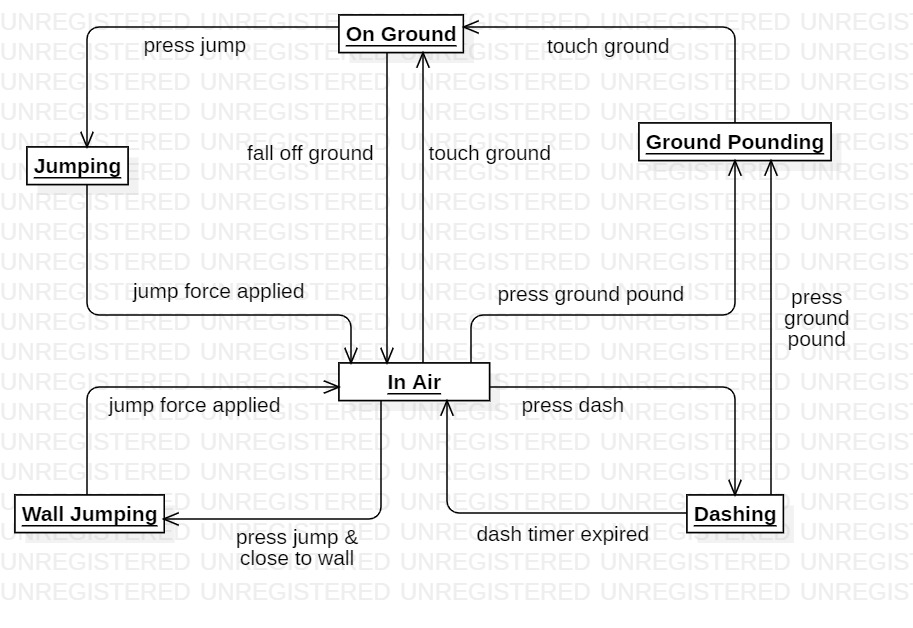

# Don't Stop Me Now! #

## Team ##
- [Sara Merengo](https://github.com/SaraMerengo) (team leader, developer)
- [Emanuele Santoro](https://github.com/emanuelesantoro) (developer)
- [Andrea Sanguineti](https://github.com/AndreaNeti) (developer)
- [Alessandro Ricci](https://github.com/alessandro-ricci-16) (developer)
- [Mohammadjavad Sami](https://github.com/MJSami13) (art)

## Overview ##

Game genre: 2D platformer, (puzzle)

The game will contain a series of short levels organized by themed sections. Most levels will be platformer-like, with simple puzzles where the introduced mechanics allow for it.

Platforms: PC, possibly mobile

## Setting ##

The protagonist of the game is an ice cube, living in a bag of ice inside a supermarket frozen products aisle. One day, it breaks free of the rest of the bag of ice and decide to explore the freezer world: its goal will be to traverse all the freezer compartments in order to reach the end.

Possible motivations:
- it saw other ice cubes being taken away from the freezer and wants to find them
- ice cube life is boring, it wants to explore the world and reach the colorful and fantastic ice cream freezer compartment
- ice cube religion says there's something at the end of the freezer

The levels will be organized by sections, or worlds, with each world introducing new mechanics.

Possible future developments:
- cutscene giving the player some background on the story
- have the worlds have different freezer-related themes, e.g. frozen vegetables, ice cream, frozen pizza,...

## Game Mechanics ##

### Core gameplay ###

**Movement**

The ice cube will move constantly and the player will not be able to stop it or change its direction directly, only to jump, dash or ground pound. Hitting obstacles such as walls or platforms will result in the ice cube changing direction. The ice cube will not bounce on the floor: every time the ice cube reaches the floor its vertical velocity will be zero.

The ice cube is affected by gravity and can fall off platforms. Falling off platforms does not damage the ice cube, unless the ice cube hits an obstacle of falls in a bottomless pit.

The horizontal velocity is fixed and does not change, except for the dash and ground pound moves (see later).

Vertical velocity is determined by gravity, jump and ground pound input.

**Jump** 

The player can make the ice cube jump. The jump has variable height up to a fixed maximum height; the height of the jump depends on how long the player presses the "jump" button for. 

The player can jump only if the character is on the ground or on a wall (wall jump). Only one wall jump is allowed until the character comes back to the ground.

Both the normal jump and the wall jump have coyote time and jump buffer timers that can be set independently.

Since the player cannot stop on a wall, for the wall jump move the "jump" button should be pressed in the interval dictated by jump buffer and coyote time.

While the player is in the air, the following actions are allowed:
1. Wall jump (only in proximity of a wall)
2. Mid-air dash
3. Ground pound

**Ground pound**

While mid-air, the player can press the "ground pound" input to make the character quickly fall down to the ground. Horizontal velocity is temporarily set to zero as the character begins falling down, then resumes in the previous direction once the player hits the ground. If the player presses the input "ground pound", all other input is suspended until the character reaches the ground. Horizontal position is frozen until the character reaches the ground, the character moves perfectly vertically during ground pound.

**Mid-air dash**

While the character is in the air, the player can perform a dash. Vertical velocity is set to 0 as well as gravity and the character receives an impulse in the current direction (the player cannot choose in which direction to dash). The characters moves horizontally at a fixed and constant speed (determined by the initial impulse) for a fixed amount of time which does not depend on player input. At the end of the dash, gravity begins to function as normal again and the default speed is restored.

The player is not allowed to dash while the ground pound action is executing. The player is not allowed to dash while touching the ground.

The player is allowed to ground pound while the dash is executing. The player is not allowed to jump or wall jump while dashing.

**Recap**

The following commands are allowed:
1. jump
2. ground pound
3. mid-air dash

On keyboard, the inputs are mapped as following:
- Jump: C, space bar or left mouse click
- Ground pound: X or S
- Mid-air dash: Z or shift

The following diagram represents the finite state machine of the ice cube states with the corresponding inputs.

### World ###

The world around the ice cube represents the inside of a freezer. All elements and collisions are perfectly horizontal or vertical with only 90 degrees angles. There are no slopes in the world.

### Gameplay elements ###

The world elements that are part of the fridge or of the background are placed on a grid.

Grid elements (all of these elements are static):
1. Regular platforms: these are platforms the ice cube can slide on and bounce off with no consequence. They represent patches of ice, parts of the plastic shelves or floor in the freezer, other contents of the freezer such as boxes of food,...
2. Static spikes: these represent ice shards in the freezer or other static obstacles which will be letal to the ice cube. The ice cube will die if it collides directly with them. They can be attached to other regular platforms in all four directions.
3. Heated platforms: some sections of the level will represent the engine of the freezer and will be heated. The ice cube can slide on them but only for a maximum allowed period of time: when the ice cube enters a heated platform, a timer will begin counting down to signify the leftover health of the ice cube. This will be represented visually by the ice cube changing color to red. If the timer expires, the player dies. 

All of these elements can be placed on the floor of the level but also mid-air with nothing supporting them (there is no regard to gravity in this sense).

Stand-alone elements:
1. Breakable platforms: platforms that break if the ice cube dashes or ground pounds on them
2. Simple enemies: some levels will contain enemies in the form of other ice cubes. The ice cube will die if it collides directly with them. They move following the same laws as the ice cube (constant speed, changing direction if hitting an obstacle, following gravity,...) but differently from the ice cube they have no input. Some enemies may have a specific trigger so they start moving only when the character collides with the trigger. Enemies may be periodically spawned by an object spawner. 
6. Movable objects: these objects do not perform any action. The player can move them around using the cube, for example to place them on spikes to be able to pass them.

On hold until further development:
1. Projectiles: some levels will contain projectiles, spawned either by enemies or other static parts of the environment. The projectiles may either have a straight trajectory or follow the laws of gravity.
2. Shooting enemies: these enemies will be able to shoot ice shards or fire balls at the character, and additionally cause the player to die if it collides directly with them. 

### Death ###

The ice cube shatters and dies if:
1. It falls off a bottomless pit
2. It collides directly with non-allowed elements: spikes, obstacles, enemies, projectiles,...
3. It stays in contact with a heated platform more than the allowed time.

After death the ice cube restarts at the nearest check-point (see later).

## Game Flow and level structure ##

The game is made up of multiple short levels, which are organised in worlds. Currently, two worlds are planned.

**World 1** contains:
- Tutorial levels for the jump action
- A very easy level with only the jump action allowed
- Tutorials and easy levels introducing the other actions in the following order: wall jump, ground pound, dash
- Levels with static spikes
- Levels introducing breakable platforms
- Levels using static spikes and breakable platforms

**World 2** contains:
- Levels introducing the following mechanics:
    1. Heaters
    2. Simple enemies
    3. Movable objects
    4. Falling spikes
- Levels using these mechanics in combination

Levels must be completed sequentially (it is necessary to complete a level to be able to access the following ones). The player can select which level to play from a level map and can select to replay a previously completed level.

For the purposes of the course, all levels will be left unlocked so that testers can play all levels.

The camera is not static and moves around following the player. Levels are mainly side-scrolling to the right but they can also have vertical sequences (both going upwards and downwards) and side scrolling in the opposite direction to give the player the sense of moving in a coherent map. 

Different actions are introduced sequentially with short tutorial levels, but they are also all available from the first level to increase replay value for players who are already familiar with the commands.

### Checkpoints

Each level is contained in a single scene and can contain up to 1/2 checkpoints. 
- When the player dies, the scene will reload and the character will be spawned at the position of the last completed checkpoint. Previously modified aspects of the level (broken platforms, moved objects,...) will reset with the death of the character. Exceptions can be made for specific levels where this would be too frustrating.
- Checkpoint completion is automatic when the character collides with the corresponding trigger and does not need any action on the player's part.
- Completing a checkpoint does not change anything about the world and does not theoretically prevent the player from going back to previous sections of the level. However, on the design part checkpoints should be placed such that the player cannot come back to previous sections because of world obstacles (e.g. a wall that is too high to jump). This is to ensure linear progression and to prevent perceived inconsistencies (breakable platforms being whole again, etc.) when reloading the scene.
- Checkpoints are not saved between different runs of the game, if the player closes the game the checkpoint progress is lost.
- Visually, checkpoints are represented by a ceiling light being green instead of white.

### Level Design

Since the player cannot change the direction of the ice cube, levels should be designed placing particular attention on making so that if the player misses a jump or other move but does not die, the ice cube does not have to travel back very long before hitting something else and resuming to go in the previous direction.

## Aesthetics

Levels should contain regularly placed celing lights representing the lights of the freezer.

Camera size should be one of the following: 10, 12, 14.

## Deadlines ##

Official deadlines:
- 6th November 2023 - Game Design Document
- 10th December 2023 - Prototype Submission
- 13th January 2024 - Beta Submission
- 27th February 2024- Final Project Submission

### Deadline 1 - 2nd November 2023 ###
- Finalise the player controller (Sara Merengo, Emanuele Santoro)
    - revise the controller and make the script more modular
    - add dashing
    - add wall jumps
    - add ground pound
    - adapt the speed updates for fans (forces instead of velocity updates)
- Implement spikes and moving obstacles (Alessandro Ricci)
- Implement heated platforms (Emanuele Santoro)
- GameManager class (death and respawn) (Andrea Sanguineti)
- Camera boundaries (Alessandro Ricci)

### Deadline 2 - 14th November 2023 ###
- Controller:
    - correct jump height calculation and ground pound (Sara Merengo)
    - only one wall jump until the character hits the ground again (Sara Merengo)
    - redo player input: input map instead of hard coded in the controller (Emanuele Santoro)
- Implement basic menu and level selection layout, UIManager (Sara Merengo)
- Create a basic level prototype containing only basic blocks (everyone). Experiment with:
    - ice cube movement parameters
    - ice cube size with respect to the platform tiles
    - screen size, camera zoom
    - horizontal scrolling vs one screen per checkpoint
- Breakable platforms (Andrea Sanguineti)
- Fans (cancelled)
- Basic character asset and tileset (Mohammadjavad Sami)

### Deadline 3 - 30th November 2023 ###

- Implement checkpoints (Sara Merengo)
- Implement moving and falling obstacles, with and without trigger (Alessandro Ricci)
- Design a small tutorial-like level (Alessandro Ricci)
- Design a level containing only the jump action and no other mechanic or world elements except for limited use of spikes / death zones (Sara Merengo, Alessandro Ricci, Emanuele Santoro, Andrea Sanguineti)
- Design a level containing only the jump and one additional action of choice (Sara Merengo, Alessandro Ricci, Emanuele Santoro, Andrea Sanguineti)
- Implement a way to disable actions for early levels (Emanuele Santoro)
- Assets for spikes and heated platforms (Mohammadjavad Sami)

## Implementation details ##

This section is meant for the programmers to keep track of implementation details.

### Ice cube ##

**Ice Cube GameObject**

The ice cube GameObject should have the following components:
1. IceCubeInput script, with the correct IceCubeParameters as parameter
2. Rigidbody2D set to dynamic, having a PhysicsMaterial2D with 0 friction; collision detection should be set to continuous to avoid problems with the collisions at high speeds
3. BoxCollider2D with no rounding at the edges (this is needed for precise collision detection)
4. IceCubeAnimatorManager script
5. Animator
6. SpriteRenderer
7. IceCubeStateManager script, with the same IceCubeParameters as the IceCubeInput script (TODO: find a fix for this)
8. "Player" tag (this is necessary for death zones to work)

**Ice cube parameters**
- Ice cube scale: 1.5
- Default speed: 17
- Jump height, wall jump height: 6
- Upward gravity scale: 20
- Downward gravity scale: 30
- Groundpound speed: 50
- Dash speed: 50
- Dash duration: 0.1
- Max Jump Coyote Time and Buffer Time: 0.05
- Max Wall Jump Coyote Time and Buffer Time: 0.1

### Tilemaps ###

A tilemap must have the following components:
1. TilemapCollider2D with flag used by composite set to true
2. Rigidbody2D set to static
3. CompositeCollider2D (this is to make sure the tilemap has a single collider with no lines for every single tile, which makes collision handling better)